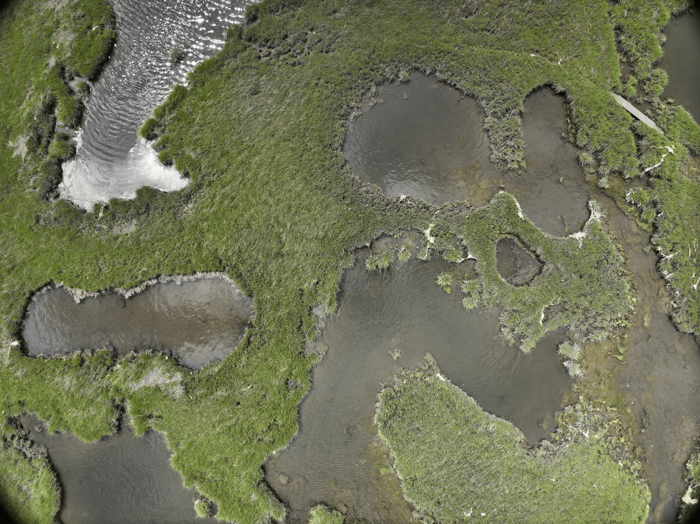
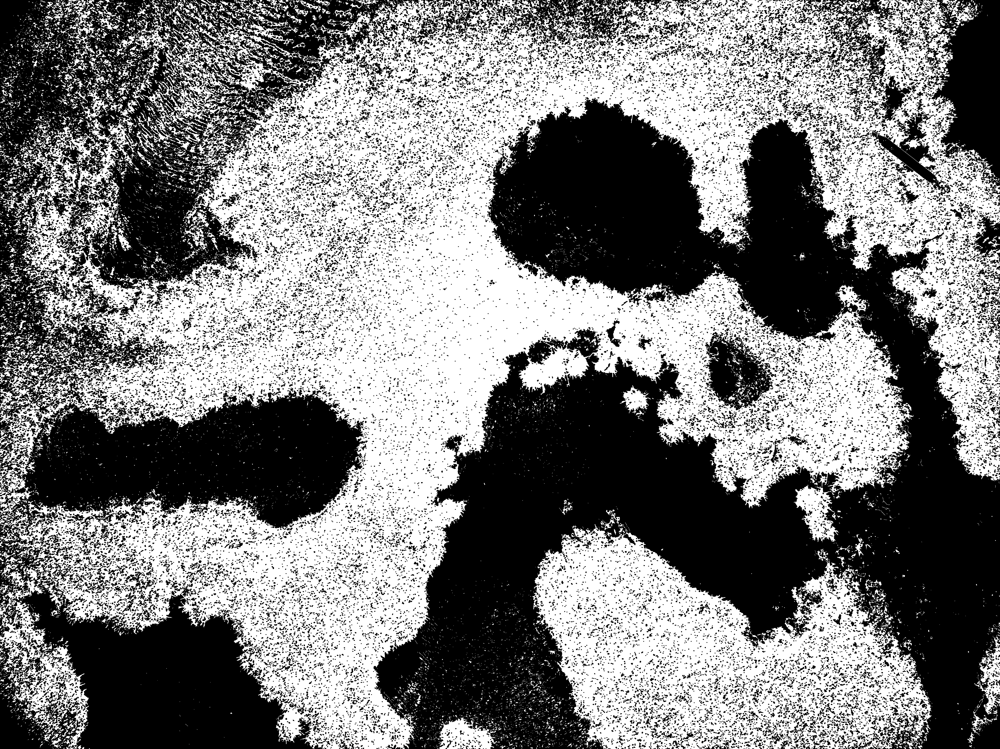
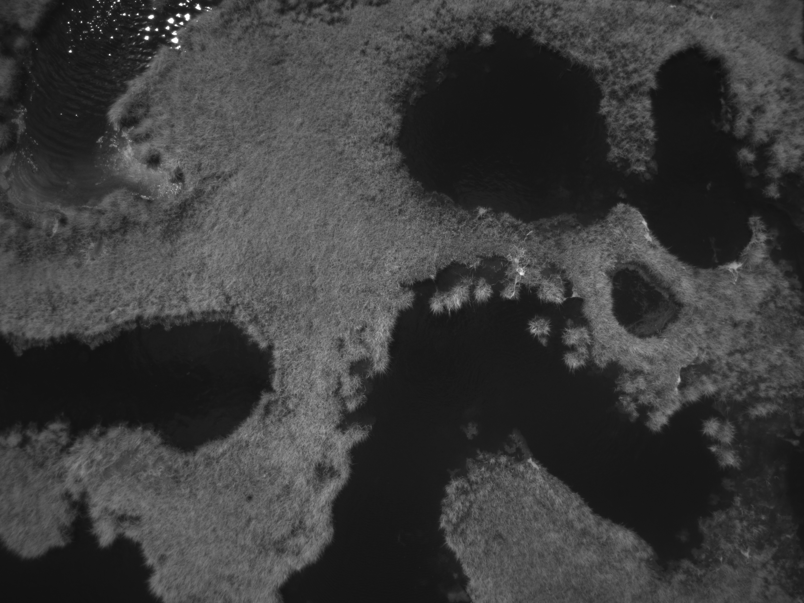
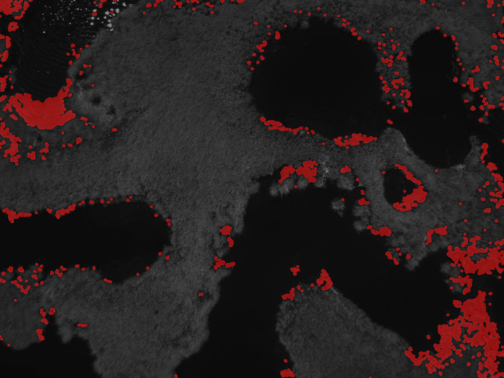

# UROP_2026_Aaron
Summer UROP on stem density quantification

This repo contains some programs useful for estimating plant density based on an image. It is designed to work on drone imagery from marsh environments.

Running the programs requires cv2 and numpy.

The program rgb_to_coverage_map.py takes in the RGB image drone.png, and uses edge density to estimate plant coverage. It will save a mask with white pixels where it detects plant cover in coverage.png. Note that this method is quite finicky and doesn’t work on blurry images.

The program bare_land_threshold.py takes in a near-infrared image nir.png, and detects larger areas that might contain extended sections of bare ground. It will save a copy of nir.png with these areas highlighted in red in bare_land.png.

